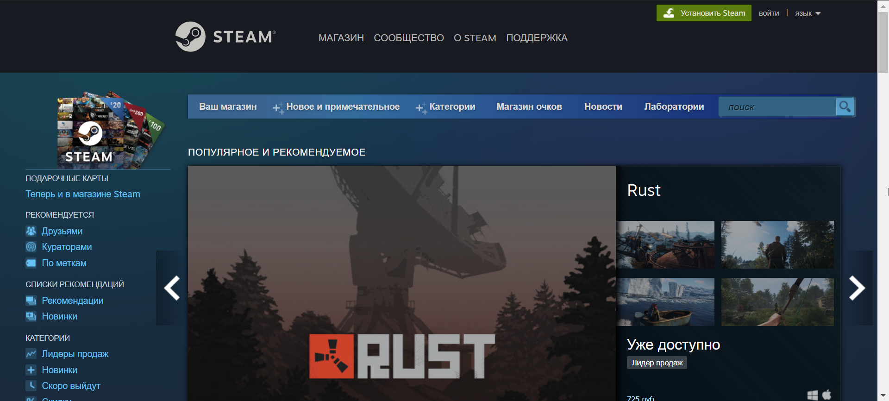
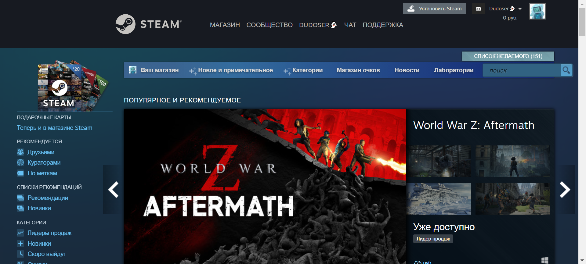
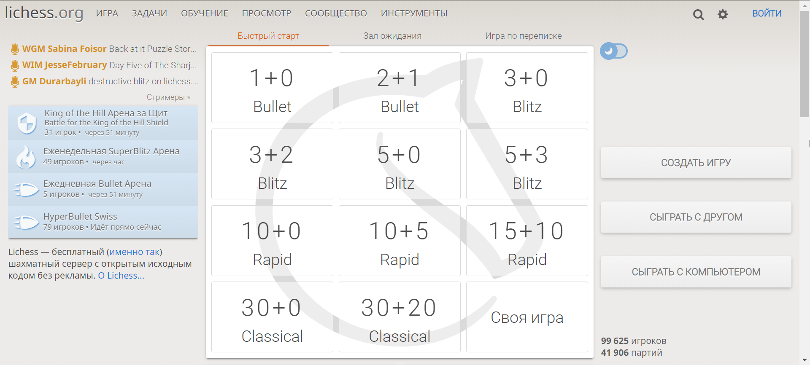
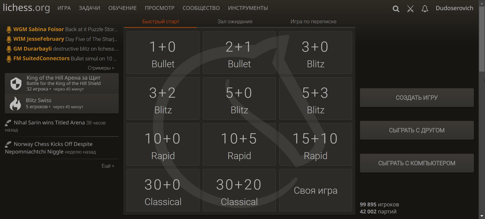

# Задача 2  
**Постановка задачи:** 
> написать эссе, в котором анализируется процесс аутентификации пользователей в двух произвольных web-ресурсах.

---

## Введение  
Множество пользователей по всему авторизируется на сайтах, но что же скрыто от глаз обычного пользователя, какие происходят запросы и какие коды ошибок выдаёт браузер? Это и ещё много другое я постараюсь разобрать в этом эссе.

---

## Основная часть
### [Steam](https://store.steampowered.com)

<small>Главная страница</small>  

Переходим на страницу авторизации и сразу же видим строку запросов, из которой можно точно сказать язык, на котором отображается сайт и видим параметр *redir_ssl: 1*. Из чего можно сделать вывод, что сервер перенаправил нас на защищённую страничку с *ssl* (криптографический протокол, который подразумевает более безопасную связь). Что за параметр snr для меня пока остаётся загадкой, но это особо и не важно в нашем анализе. Самое главное сервер вернул нам код 200, что говорит об успешности запроса. 

Давайте же теперь авторизуемся. При успешной авторизации, при условии, что у пользователя стоит двухфакторная аутентификация, у нас выполнятся запрос *getrsakey/* и *dologin/*. 

**RSA** - криптографический алгоритм с открытым ключом, основывающийся на вычислительной сложности задачи факторизации больших целых чисел, так что предположу, что первый запрос ищет и возвращает наш id в базе данных, так как ответ при успешной авторизации в куки параметру *steamLoginSecure* задаёт зашифрованный логин, и если такой есть, то выполняется следующий запрос. Так же в обоих запросах мы видим, что в request есть заголовок, в котором передаётся страна пользователя, id браузера и ещё куча всего интересного. И по мимо всего этого ответ приходит в виде Json файла.  

Так же по мимо всего вышеперечисленного выполняются запросы на отображение модального окна *"МОБИЛЬНАЯ АУТЕНТИФИКАЦИЯ STEAM GUARD"*.  

При успешно введённом коде двухфакторки, нас уже перебрасывает на главную страничку с играми со своей кучей запросов. В сеттере куки мы можем видеть всё те же наши данные.  Если же мы неправильо введём код двухфакторки, эти два запроса выполнятся снова, но в *Form Data* запишется ввёдый нами код в заголовок twofactorcode, который не проходит проверку и нас не пускает дальше.  

И самое интересное, что даже при неудачной авторизации на первом этапе(не доходя до двухфакторки) будут выполнены запросы, в ответ на которые сервер вернёт код **200**. Почему это интересно, увидим немного позже.

Из всего этого можно сделать вывод, что Стим никуда нас не пустит, пока точно не убедится, что мы - это мы и в любом случае выдаст нам код **200**.

<small>Мы авторизовались :D</small>

---

### [lichess](lichess.org)

Перейдя на страницу авторизации: https://lichess.org/login?referrer=/ видим примерно ту же картину в запросах, однако тут нас уже нет двухфакторной аутентификации.  

Если мы попробуем ввести неверный логин или пароль, то наш запрос несколько изменится с */login?referrer=/* на */login?referrer=%2F*, т.е. наша строка запроса изменится, да и сам запрос подсветится красным, так как сервер возвращает нам код 401, означающий неверную авторизацию.  

Все наши введённые же данные всё так же записываются в *Form Data*.  

При успешной же авторизации нас всё так же, как и в предыдущем примере, перекидывает на главную страничку и мы оказываемся уже авторизованным пользователем.  

<small>Успешная авторизация :D</small>

---

## Вывод
Таким образом, атентификация на двух разных сайтах может координально отличаться, но какая-то основная база будет та же. Это всё тот же старый добрый поиск в базе данных записи с логином и паролем. Если же запись не будет найдена, на странице будет выведено сообщение об ошибке авторизации и в зависимости от реализации вернётся код с ошибкой авторизации. 